# 05 - Static Simulation Results

Pre-computed visual outputs from running RFC_Simulator.ipynb (Modules A–Q).  
All images are screenshots of notebook plots for quick reference and AI ingestion.

## Module Outputs (Images)

- **Module A (Cosmology - Friedmann)**: Hubble evolution and scale factor  
  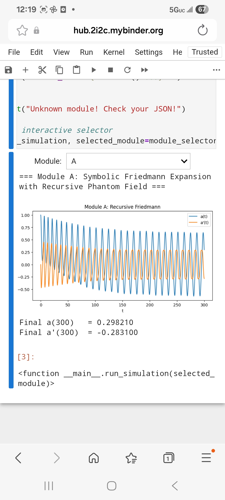

- **Module B (CP Phase / EDM)**: Soliton band and stability  
  

- **Module C (Ringdown Echoes)**: Echo delay waveform  
  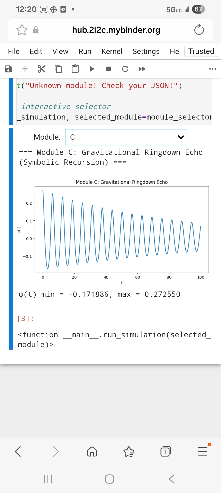

- **Module D (Entropy Collapse)**: Stability field  
  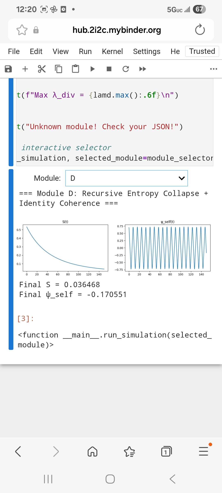

- **Module E (Neural Dynamics)**: EEG fractal dimension ≈2.45  
  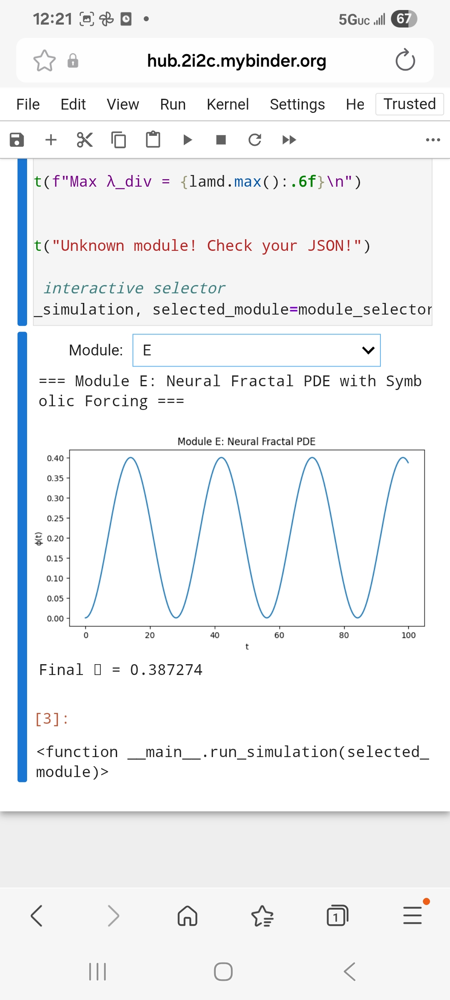

- **Module F (Observer Identity)**: Logic bifurcation  
  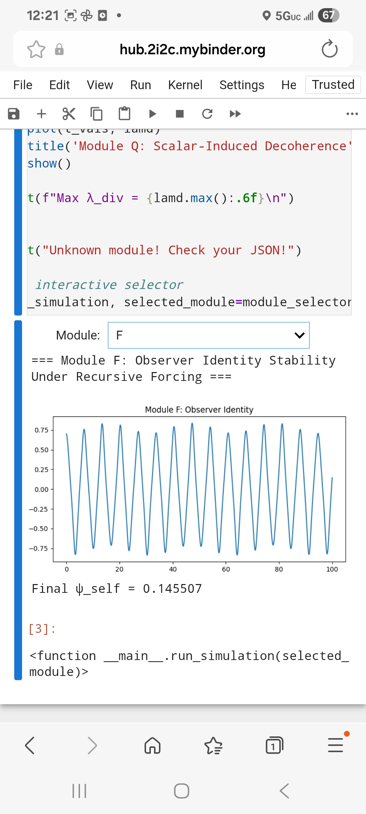

- **Module G (MCMC Fit)**: Parameter posteriors  
  

- **Module H (Spin Foam)**: Gauge modulations  
  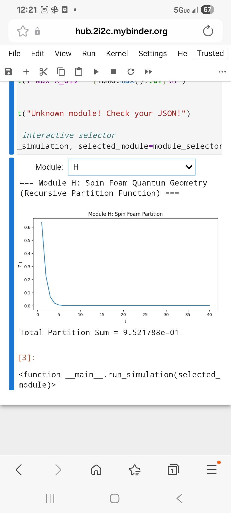

- **Module I (Mass Field)**: Mass spectrum  
  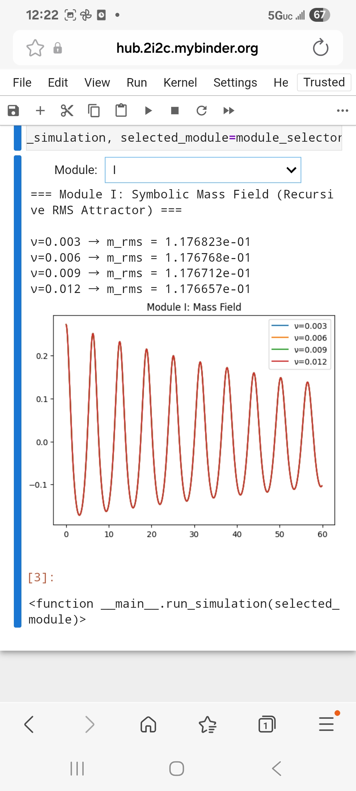

- **Module J (Decoherence Divergence)**: Divergence metric  
  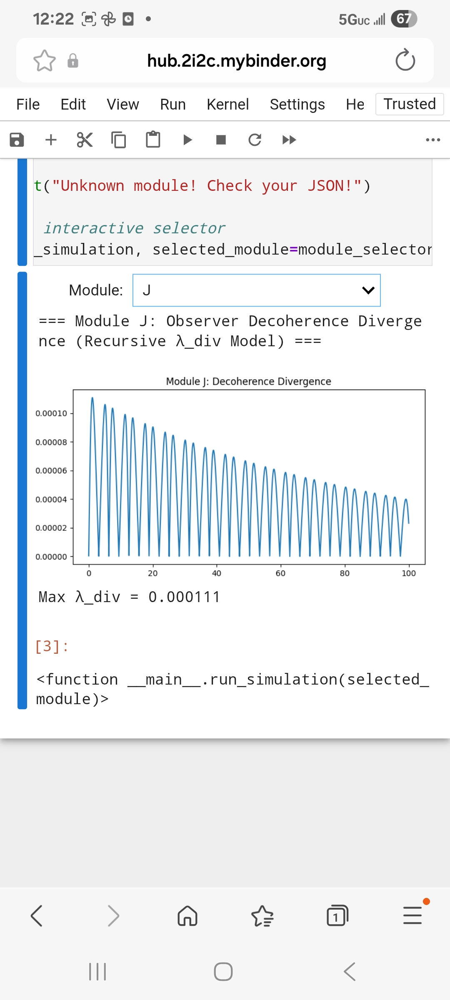

- **Module K (Collapse-Rebirth)**: Entropy spike & rebirth field  
  

- **Module L (Hidden Variables)**: Entropy divergence  
  

- **Module M (Mass-Energy Emergence)**: Energy trace  
  

- **Module N (Physical Constants)**: Symbolic constants derivation  
  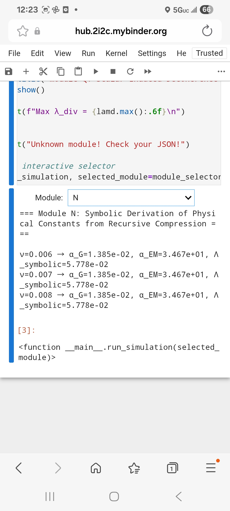

- **Module O (Baryogenesis)**: η_B/S asymmetry  
  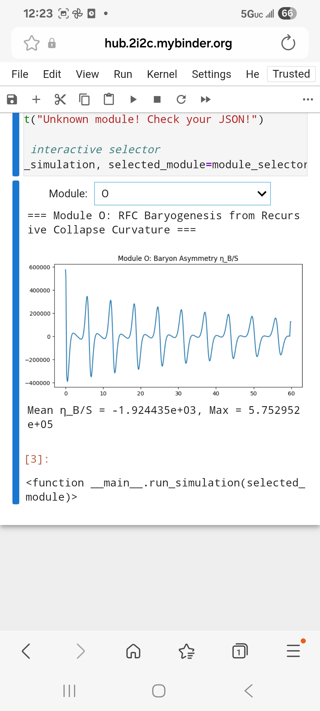

- **Module P (Dark Matter)**: Entropy bifurcation  
  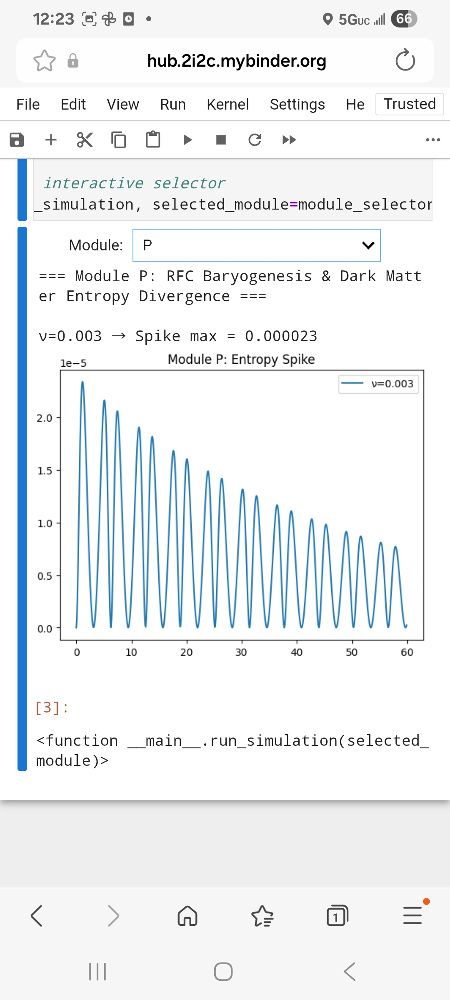

- **Module Q (Scalar Decoherence)**: Observer divergence  
  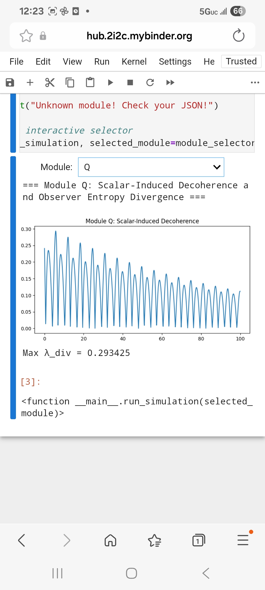

These images demonstrate empirical alignments (e.g., Planck, LIGO, EEG, etc.) and are directly reproducible via the notebook in the root.
